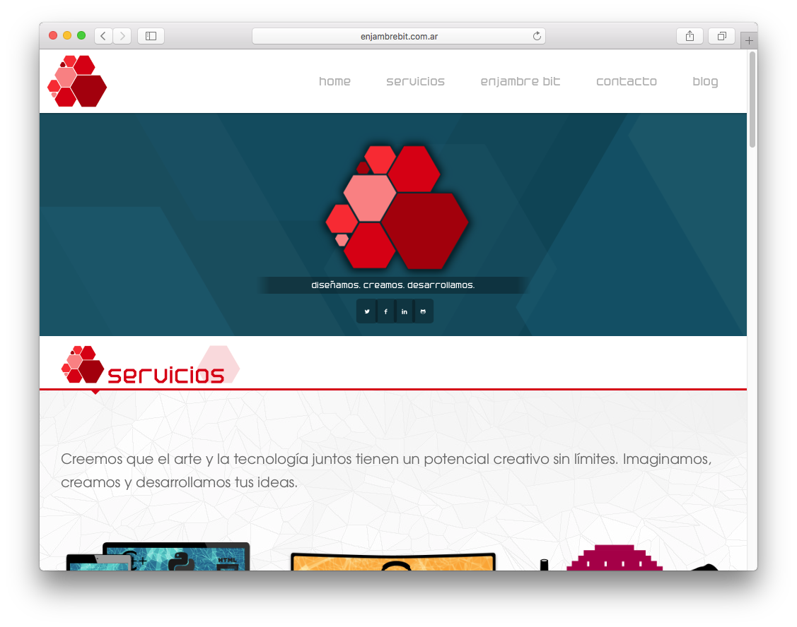

# Website

## ¿Cómo funciona?

El sitio de enjambre se realizó con emberjs, y está configurado junto con un servidor
de integración contínua llamado travis. Cada vez que hacemos un push al repositorio (con una marca
de tag) travis se encarga de ejecutar todos los casos de prueba y realizar el deploy a gitpages.

Puedes ver el historial de test de este [sitio en travis.ci](https://travis-ci.org/EnjambreBit/website).

